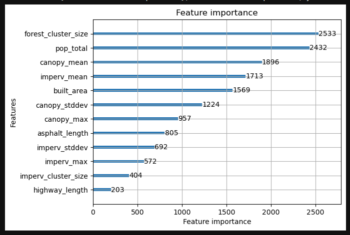
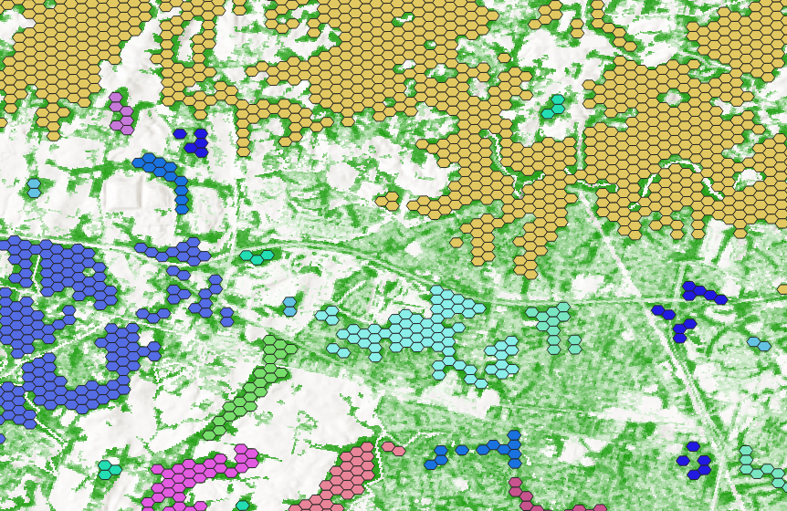
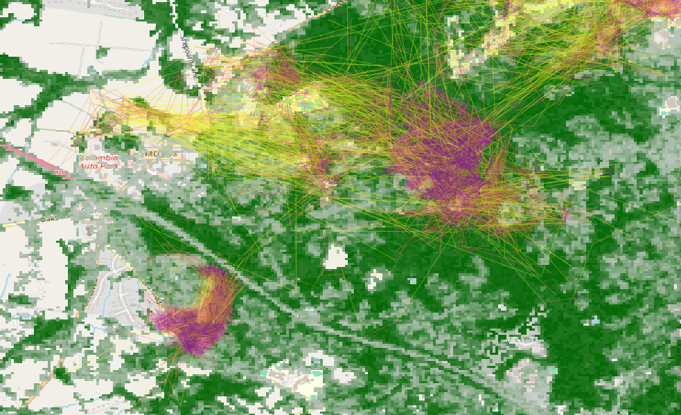
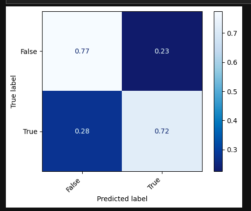

# environment-geodatabase
Repository to automate the building and sharing of GIS data using Docker, OGC standards and PostGIS tools.

This git repository is aimed at deploying a spatial database and OGC API capable of storing GPS tracking data and making it available to users as:
 - Raw and aggregated GPS position data
 - Publically available raster and vector data describing the environment
 - Publically available human population data
 - Aggregations of the environment data

This repository creates a Postgres+PostGIS+TimescaleDB database using docker and docker compose. This database is configured using files stored in [./config](./config/README.md), scripts stored in [./build/db_init_scripts](./build/README.md), and initial data stored in [./build/db_init_data](./build/README.md).

# Quick Start
To run this project you will need docker [installed](https://docs.docker.com/engine/install/) and configured on your machine. 

```bash
# Clone this repository to your machine:
git clone https://github.com/GMU-GeoSciences/environment-geodatabase
# Move the sample.env file to the root directoryand rename it to .env
cp ./config/sample.env .env
# Edit the file using your text editor of choice 
nano .env
# Build the database container using docker. Repeat this whenever you edit the files in ./build
docker compose build
# Run the container, in the background
docker compose up -d
# Check the log files to see what's going on
docker compose logs -f
```

Once the database has been created and all the scripts completed the GPS data needs to be inserted. This is either done with live data (to-do) or with historical data. Once GPS data is inserted the materialized views in the DB must be updated. 

# Methodology
This section covers what this data is being used for, how it is being aggregated and the end goal: 

  - Data is downloaded from the internet, or gathered from files and inserted into the Postgres database.
  - Various views are created that describe deer behaviour
  - Various views are created that describe the local environment 
  - These views are aggregated over a hexagonal grid and used as labels and input features for the training and testing of a machine learning algorithm
  - This algorithm is used to predict deer liklihood for areas not covered by deer with GPS transmitters.

## Input Data
[White Tail deer GPS tracking data](https://link.springer.com/article/10.1007/s11252-022-01270-3) is being collected and is saved as a CSV file. This file is being processed and inserted into the database with the "Insert into DB" notebook. 

[NLCD Raster environmental data](https://www.mrlc.gov/data?f%5B0%5D=year%3A2019) is also collected and inserted into the database:
  - 2019 NLCD Canopy Cover: NLCD tree canopy cover geospatial datasets with spatial resolutions of 30 m are produced by the USDA Forest Service. Tree canopy cover is derived from multi-spectral satellite imagery and other available ground and ancillary information.
  - 2019 NLCD Impervious Surfaces: NLCD imperviousness products represent urban impervious surfaces as a percentage of developed surface over every 30-meter pixel in the United States.
  - 2019 NLCD LandCover: The National Land Cover Database (NLCD) provides nationwide data on land cover and land cover change at a 30m resolution with a 16-class legend based on a modified Anderson Level II classification system.

OpenStreetMap vector data for Maryland is downloaded and inserted into the DB:
  - Downloaded from https://download.geofabrik.de/north-america/us/maryland.html
  - Inserted using https://osm2pgsql.org/

Howard County Census Block data is downloaded and inserted:
   - Downloaded from https://www2.census.gov/geo/tiger/GENZ2023/shp/
   - Inserted using [shp2pgsql](https://postgis.net/docs/using_postgis_dbmanagement.html)

High Resolution Human Population data is downloaded, processed and inserted into DB:
  - Downloaded from https://data.humdata.org/dataset/united-states-high-resolution-population-density-maps-demographic-estimates
  - Processed and inserted using "PopDensity" notebook.
  - Processing removes all points not within Howard County and joins all the different population types into a single geometry.
  - Data is inserted into DB using same notebook 

## Generated Data
Data is spatially aggregated over a [hexagon grid](https://www.crunchydata.com/blog/tile-serving-with-dynamic-geometry) that covers the area of interest. Features are created for the grid and allow the creation of a model that uses the environmental data to predict the likelihood of deer being present within the hexagon. These features are generated from materialized views created in the 550_raster_hex_summary.sql and 600_api_functions.sql (needs a rename) files.

## Environmental Features
*These are still under development and need to be formalised and added to the start up scripts.*



Initial testing has been done using the following variables:
  - Canopy/Impervious Surface Cluster Size: Clusters are created from hexagons that have neighbouring cells with similar feature values. The cells contain the number of cells within the same cluster. 
  - Population Total: Night Time Population count within grid cell
  - Canopy Mean/Max/Min/Stddev: Statistics derived from NLCD raster clipped to grid cell
  - Impervious Surfaces Mean/Max/Min/Stddev: Statistics derived from NLCD raster clipped to grid cell
  - Built Area: Portion of hex cell covered by OSM defined buildings
  - Asphalt/Highway Length: Length of OSM defined highways or asphalt roads within grid cell

*More work needs to be done to determine features that are related to neighbouring cells. Something like the Fragstats connectivity or [spatial autocorellation](https://gis.stackexchange.com/questions/59614/implementing-spatial-autocorrelation-using-qgis-or-postgresql-or-any-other-free).*



## Deer Probability Classification or Regression
A window function is used over GPS data to determine the time and distance delta's from the same device id. This allows us to determine the speed between GPS messages. When this is plotted onto a map it becomes clear that deer have locations where they prefer to rest and they travel between these locations: 



Deer behaviour can therefore be split by movement speed: 
  - At rest: Speed < X meters/hour
  - Travelling: Speed > X meters/hour
* A value for X must still be determined. *

The GPS data can be aggregated over the hexagon cells to determine cells mostly used for resting, cells used for travelling and cells avoided. This is done by sampling cells that are within the MCP-100 of the individual, and those that are never rested or travelled through are considered "avoided". 

* Needs to include Gridsearch optimisation and cross validation, but will need smaller grid cells for that. *

First stab at confusion matrix of deer presence vs no deer presence:



# Sub-Directory Readme's
 
 - [Build](./build/README.md)
 - [Config](./config/README.md)
 - [Docs](./docs/README.md)
 - [Notebooks](./notebooks/README.md)
